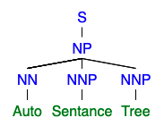

<!--
*** Thanks for checking out this README Template. If you have a suggestion that would
*** make this better, please fork the repo and create a pull request or simply open
*** an issue with the tag "enhancement".
*** Thanks again! Now go create something AMAZING! :D
-->


<!-- PROJECT SHIELDS -->
<!--
*** I'm using markdown "reference style" links for readability.
*** Reference links are enclosed in brackets [ ] instead of parentheses ( ).
*** See the bottom of this document for the declaration of the reference variables
*** for contributors-url, forks-url, etc. This is an optional, concise syntax you may use.
*** https://www.markdownguide.org/basic-syntax/#reference-style-links
-->
<p align="center">

  <a href="https://github.com/Lucas-Kohorst/react-sentence-tree" align="center">
    
  </a>

  <h3 align="center">React Sentence Tree</h3>

  <p align="center">
    Quickly visualize sentences in a Tree Diagram
    <br />
    <a href="https://npm.runkit.com/react-sentence-tree">View Demo</a>
    ·
    <a href="https://github.com/Lucas-Kohorst/react-sentence-tree/issues">Report Bug</a>
    ·
    <a href="https://github.com/Lucas-Kohorst/react-sentence-tree/issues">Request Feature</a>
  </p>

  <div align="center">
  <a href="https://github.com/Lucas-Kohorst/react-sentence-tree//network/members"></img></a>
  <a href="https://github.com/Lucas-Kohorst/react-sentence-tree//stargazers"></img></a>
  <a href="https://github.com/Lucas-Kohorst/react-sentence-tree//issues"></img></a>
  <a href="https://github.com/Lucas-Kohorst/react-sentence-tree/blob/master/LICENSE"></img></a>
  <a href="https://linkedin.com/in/lucaskohorst"></img></a>
  </div>

</p>


<!-- TABLE OF CONTENTS -->
## Table of Contents

* [About the Project](#about-the-project)
  * [Built With](#built-with)
* [Getting Started](#getting-started)
  * [Installation](#installation)
  * [Building](#building)
* [Documentation](#documentation)
* [Roadmap](#roadmap)
* [Contributing](#contributing)
* [License](#license)
* [Contact](#contact)
* [Acknowledgements](#acknowledgements)

<!-- ABOUT THE PROJECT -->
## About The Project

A sentence diagram is an easy way to view the structure of a sentence. Build a tree from sentence with this react component.

### Built With
* [React](https://github.com/facebook/react)
* [CoreNLP - NPM](https://www.npmjs.com/package/corenlp)
* [react-d3-Tree](https://www.npmjs.com/package/react-d3-tree)

<!-- GETTING STARTED -->
## Getting Started

#### Import 
```
import { SentenceTree } from 'react-sentence-tree
<SentenceTree sentence="The little dog ran fast"> // With custom sentence

<SentenceTree> // Will generate with fallback data

<SentenceTree textbox=true> // With textbox for sentence input
```

#### Building
Install 
```
npm i 
```

Update corenlp request-promise-native. Navigate to node_modules/corenlp/dist/connector/connector-server.js

Change this line 
```
var _requestPromiseNative = require('request-promise-native');
```

To this. In order to properly import request-promise-native

```
var _requestPromiseNative = require('../polyfills/request-promise-native');
```

Run it!
```
npm start
```

<!-- USAGE EXAMPLES -->
## Usage

```
import { SentenceTree } from 'react-sentence-tree
<SentenceTree sentence="The little dog ran fast"> // With custom sentence

<SentenceTree> // Will generate with fallback data

<SentenceTree textbox=true> // With textbox for sentence input
```

<!-- Documentation -->
## Documentation
## Props
| Property                      | Type                   | Options                                                                                | Required? | Default                                                       | Description                                                                                                                                                                                                                                                                                                                                                                                                                                                                                                                                            |
|:------------------------------|:-----------------------|:---------------------------------------------------------------------------------------|:----------|:--------------------------------------------------------------|:-------------------------------------------------------------------------------------------------------------------------------------------------------------------------------------------------------------------------------------------------------------------------------------------------------------------------------------------------------------------------------------------------------------------------------------------------------------------------------------------------------------------------------------------------------|
| `data`                        | `array`<br/>`object`   |                                                                                        | required  | `undefined`                                                   | Single-element array containing the root node object (see `myTreeData` above). <br/> Passing the root node object without an array wrapping it is also possible. <br /><br /> `react-d3-tree` will automatically attach a unique `id` attribute to each node in the DOM, as well as `data-source-id` & `data-target-id` attributes to each link connecting two nodes.                                                                                                                                                                                  |
| `nodeSvgShape`                | `object`               | see [Node shapes](#node-shapes)                                                        |           | `{shape: 'circle', shapeProps: {r: 10}}`                      | Sets a specific SVG shape element + shapeProps to be used for each node.                                                                                                                                                                                                                                                                                                                                                                                                                                                                               |
| `nodeLabelComponent`          | `object`               | see [Using foreignObjects](#using-foreignobjects)                                      |           | `null`                                                        | Allows using a React component as a node label; requires `allowForeignObjects` to be set.                                                                                                                                                                                                                                                                                                                                                                                                                                                              |
| `onClick`                     | `func`                 |                                                                                        |           | `undefined`                                                   | Callback function to be called when a node is clicked. <br /><br />Has the function signature `(nodeData, evt)`. The clicked node's data object is passed as first parameter, event object as second.                                                                                                                                                                                                                                                                                                                                                  |
| `onMouseOver`                 | `func`                 |                                                                                        |           | `undefined`                                                   | Callback function to be called when mouse enters the space belonging to a node. <br /><br />Has the function signature `(nodeData, evt)`. The clicked node's data object is passed as first parameter, event object as second.                                                                                                                                                                                                                                                                                                                         |
| `onMouseOut`                  | `func`                 |                                                                                        |           | `undefined`                                                   | Callback function to be called when mouse leaves the space belonging to a node. <br /><br />Has the function signature `(nodeData, evt)`. The clicked node's data object is passed as first parameter, event object as second.                                                                                                                                                                                                                                                                                                                         |
| `onLinkClick`                 | `func`                 |                                                                                        |           | `undefined`                                                   | Callback function to be called when a link is clicked. <br /><br />Has the function signature `(linkSource, linkTarget, evt)`. The clicked link's parent data object is passed as first parameter, the child's as second, the event object as third.                                                                                                                                                                                                                                                                                                   |
| `onLinkMouseOver`             | `func`                 |                                                                                        |           | `undefined`                                                   | Callback function to be called when mouse enters the space belonging to a link. <br /><br />Has the function signature `(linkSource, linkTarget, evt)`. The clicked link's parent data object is passed as first parameter, the child's as second, the event object as third.                                                                                                                                                                                                                                                                          |
| `onLinkMouseOut`              | `func`                 |                                                                                        |           | `undefined`                                                   | Callback function to be called when mouse leaves the space belonging to a link. <br /><br />Has the function signature `(linkSource, linkTarget, evt)`. The clicked link's parent data object is passed as first parameter, the child's as second, the event object as third.                                                                                                                                                                                                                                                                          |
| `onUpdate`                    | `func`                 |                                                                                        |           | `undefined`                                                   | Callback function to be called when the inner D3 component updates. That is - on every zoom or translate event, or when tree branches are toggled. <br /><br />Has the function signature `(updateTarget: {targetNode, currentTranslate, currentZoom})`.                                                                                                                                                                                                                                                                                               |
| `orientation`                 | `string` (enum)        | `horizontal` `vertical`                                                                |           | `horizontal`                                                  | `horizontal` - Tree expands left-to-right. <br /><br /> `vertical` - Tree expands top-to-bottom.                                                                                                                                                                                                                                                                                                                                                                                                                                                       |
| `translate`                   | `object`               |                                                                                        |           | `{x: 0, y: 0}`                                                | Translates the graph along the x/y axis by the specified amount of pixels (avoids the graph being stuck in the top left canvas corner).                                                                                                                                                                                                                                                                                                                                                                                                                |
| `pathFunc`                    | `string (enum)`/`func` | `diagonal`<br/>`elbow`<br/>`straight`<br/>`customFunc(linkData, orientation)`          |           | `diagonal`                                                    | `diagonal` - Smooth, curved edges between parent-child nodes. <br /><br /> `elbow` - Sharp edges at right angles between parent-child nodes.  <br /><br /> `straight` - Straight lines between parent-child nodes. <br /><br /> `customFunc` - Custom draw function that accepts `linkData` as its first param and `orientation` as its second.                                                                                                                                                                                                        |
| `collapsible`                 | `bool`                 |                                                                                        |           | `true`                                                        | Toggles ability to collapse/expand the tree's nodes by clicking them.                                                                                                                                                                                                                                                                                                                                                                                                                                                                                  |
| `useCollapseData`             | `bool`                 | see [Pre-defining a node's `_collapsed` state](#pre-defining-a-nodes-_collapsed-state) |           | `false`                                                       | Toggles whether the tree should automatically use any `_collapsed: bool` properties it finds on nodes in the passed data set to configure its initial layout.                                                                                                                                                                                                                                                                                                                                                                                          |
| `shouldCollapseNeighborNodes` | `bool`                 |                                                                                        |           | `false`                                                       | If a node is currently being expanded, all other nodes at the same depth will be collapsed.                                                                                                                                                                                                                                                                                                                                                                                                                                                            |
| `initialDepth`                | `number`               | `0..n`                                                                                 |           | `undefined`                                                   | Sets the maximum node depth to which the tree is expanded on its initial render. <br /> Tree renders to full depth if prop is omitted.                                                                                                                                                                                                                                                                                                                                                                                                                 |
| `depthFactor`                 | `number`               | `-n..0..n`                                                                             |           | `undefined`                                                   | Ensures the tree takes up a fixed amount of space (`node.y = node.depth * depthFactor`), regardless of tree depth. <br /> **TIP**: Negative values invert the tree's direction.                                                                                                                                                                                                                                                                                                                                                                        |
| `zoomable`                    | `bool`                 |                                                                                        |           | `true`                                                        | Toggles ability to zoom in/out on the Tree by scaling it according to `props.scaleExtent`.                                                                                                                                                                                                                                                                                                                                                                                                                                                             |
| `zoom`                        | `number`               | `0..n`                                                                                 |           | `1`                                                           | A floating point number to set the initial zoom level. It is constrained by `props.scaleExtent`. `1` is the default "non-zoomed" level.                                                                                                                                                                                                                                                                                                                                                                                                                |
| `scaleExtent`                 | `object`               | `{min: 0..n, max: 0..n}`                                                               |           | `{min: 0.1, max: 1}`                                          | Sets the minimum/maximum extent to which the tree can be scaled if `props.zoomable` is true.                                                                                                                                                                                                                                                                                                                                                                                                                                                           |
| `nodeSize`                    | `object`               | `{x: 0..n, y: 0..n}`                                                                   |           | `{x: 140, y: 140}`                                            | Sets a fixed size for each node. <br /><br /> This does not affect node circle sizes, circle sizes are handled by the `circleRadius` prop.                                                                                                                                                                                                                                                                                                                                                                                                             |
| `separation`                  | `object`               | `{siblings: 0..n, nonSiblings: 0..n}`                                                  |           | `{siblings: 1, nonSiblings: 2}`                               | Sets separation between neighbouring nodes, differentiating between siblings (same parent) and non-siblings.                                                                                                                                                                                                                                                                                                                                                                                                                                           |
| `transitionDuration`          | `number`               | `0..n`                                                                                 |           | `500`                                                         | Sets the animation duration (in ms) of each expansion/collapse of a tree node. <br /><br /> Set this to `0` to deactivate animations completely.                                                                                                                                                                                                                                                                                                                                                                                                       |
| `textLayout`                  | `object`               | `{textAnchor: enum, x: -n..0..n, y: -n..0..n, transform: string}`                      |           | `{textAnchor: "start", x: 10, y: -10, transform: undefined }` | Configures the positioning of each node's text (name & attributes) relative to the node itself. Defining a `textLayout` property on a node passed in `props.data` will override this global configuration for that node.<br/><br/>`textAnchor` enums mirror the [`text-anchor` spec](https://developer.mozilla.org/en-US/docs/Web/SVG/Attribute/text-anchor).<br/><br/>`x` & `y` accept integers denoting `px` values.<br/><br/> `transform` mirrors the [svg `transform` spec](https://developer.mozilla.org/en-US/docs/Web/SVG/Attribute/transform). |
| `styles`                      | `object`               | see [Styling](#styling)                                                                |           | `Node`/`Link` CSS files                                       | Overrides and/or enhances the tree's default styling.                                                                                                                                                                                                                                                                                                                                                                                                                                                                                                  |
| `allowForeignObjects`         | `bool`                 | see [Using foreignObjects](#using-foreignobjects)                                      |           | `false`                                                       | Allows use of partially supported `<foreignObject />` elements.                                                                                                                                                                                                                                                                                                                                                                                                                                                                                        |
| `circleRadius` (legacy)       | `number`               | `0..n`                                                                                 |           | `undefined`                                                   | Sets the radius of each node's `<circle>` element.<br /><br /> **Will be deprecated in v2, please use `nodeSvgShape` instead.**                                                                                                                                                                                                                                                                                                                                                                                                                        |


<!-- ROADMAP -->
## Roadmap
See the [open issues](https://github.com/Lucas-Kohorst/react-sentence-tree/issues) for a list of proposed features (and known issues).

<!-- CONTRIBUTING -->
## Contributing

Contributions are what make the open source community such an amazing place to be learn, inspire, and create. Any contributions you make are **greatly appreciated**.

1. Fork the Project
2. Create your Feature Branch (`git checkout -b feature/AmazingFeature`)
3. Commit your Changes (`git commit -m 'Add some AmazingFeature'`)
4. Push to the Branch (`git push origin feature/AmazingFeature`)
5. Open a Pull Request

<!-- LICENSE -->
## License
Distributed under the MIT License. See `LICENSE` for more information.

<!-- CONTACT -->
## Contact
[@KohorstLucas](https://twitter.com/KohoestLucas)<br />
[kohorstlucas@gmail.com](mailto:kohorstlucas@gmail.com)

<!-- ACKNOWLEDGEMENTS -->
## Research and Acknowledgments
* [Penn Treeebank Constitutes](http://surdeanu.info/mihai/teaching/ista555-fall13/readings/PennTreebankConstituents.html)
* [Stanford NLP Parser](https://nlp.stanford.edu/software/lex-parser.shtml)
* [Syntax Tree](http://mshang.ca/syntree/)
* [NLP Morphology and Dependency Trees](https://cloud.google.com/natural-language/docs/morphology)
* [A Fundamental Algorithm for Dependency Parsing](http://web.stanford.edu/~mjkay/covington.pdf)
* [Tree Syntax of Natural Language](cs.cornell.edu/courses/cs474/2004fa/lec1.pdf)